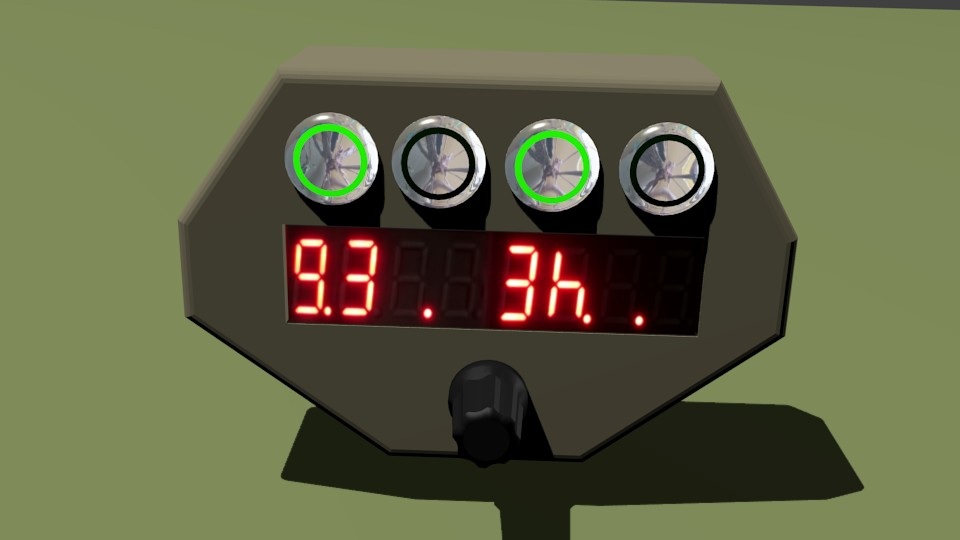

# Description of the device
Elbanquos Kitchentimer consist of the following elements:
* 8 diget display, using 2 digits for ervery timer or all digits for showing detailled time information
* one button for every timer
* one state led for every timer (integrated in the button)
* one general knob to adjust time values (can also be pushed)

# Quick start
To **activate** a timer:
* **turn knob** to adjust the time
* **press timer button** of an inactive timer ->  the timer starts. You will see the remaining time on the digits for the timer. The state led will be lit continuosly

To **check remaining time** in detail:
* **press timer button** of the active timer -> time will be displayed in full detail
* **press timer button** of the timer agai -> switch back to normal display

**When reaching 0 seconds** the timer will trigger the alarm and blink with a rapid pattern.
By **pressing the timer button** you ackknowledge and dismiss the alarm. This will also be done automatically after 15 seconds. 

The timer will continue to count the time after the alarem. The timer led will be off now (so the timer is free to be used again) The digits of the timer will show "\_.\" alternatiing to the counted time for 2 minutes. After 2 minutes, the digits will display "\_.\_" continuosly. To see the time since the alarm, press the timer button.

To **deactiveate** a running the timer completely: 
* **press timer button** to check the timers timer
* **press and hold the timer button** for 5 seconds -> The display will show "OF" at the timers digits for 2 seconds, and the timer is completly stopped

# Understanding the display information
## Compact display (Main display)
The compact display, shows all timer states in paralell. Every timer is represented by 2 digits of the display as follows:
* Tiime information
    * "zz" (two numbers, no decimal point, counting down) - remaining seconds zz  
    * "y.z" (two numbers, separated with a decimal point) - above 60 seconds: first digit - y minutes remaining, second digit - z 10 second steps remaining
    * "yy." (two numbers, followed by decimal point) - above 10 minutes: remaining minutes
    * "xh." - (one number followed by the letter "h") - above 1 hour: remaining hours
    * "Hx." - (letter "H" followed by number)- abve 10 hours: remaining 10 hour steps
    * "vd." - (a number followed by the letter "d") - above 24 hours: remaining days 
* State information
    * only the decimal point - timer is not active at all
    * "\_.\_" - timer is after alarm time
    * "\_.\_" alternating with time display - timer is less then 2 minutes after alarm time
    * "°_" or "_°" - timer has alarm

Examples:
* 12 = 12 seconds 
* 5.3 = 5 minutes and 30-39 seconds
* 24. = 24 minutes
* 2h  = betweenn 2 hours and 2 hours, 59 minutes and 59 seconds
* 4d  = at least 4 days, but less then 5 days

Examples of mutliple timer display
* 33.2d . \_.\_   = 
    * timer 1 due in 33 seconds
    * Timer 2 due in  2 to 3 days
    * Timer 3 not running
    * Timer 4 alarm is over, but counting up in the background
 
## Detailled display
The detalled display is used when selecting the time or when showing detailed information for a timer. 
There are two formats:

* xxhyy.zz - below 24 hours: x hours, yy minutes and zz seconds
* vdxxhyy. - above 24 hours: v days, xx hours and yy minutes.

Examples:
* 14h22.58 = 14 hours, 22 minutes, 58 seconds 
* 3d 7h29. = 3 days, 7 hours, 29 minutes

## Meaning of the timer led
* LED continuosly **off**: The timer is deactivated or over due with a deactiveted alarm. Timer is ready to be used for a new time setting. 
* LED due in  **on**: Timer is **running** (You can only change the timer after pressing it's button first)
* LED **blinks fast with short pauses** : Timer is on **alert**
* LED **blinks**: Der timer is **selected** in the main display and might be modifed by next operation
* LED blink with the **rhythm of a heart**: timer is on **hold**

# Detailied operation instructions
(to be done in english. Check german version for "inspiration")
