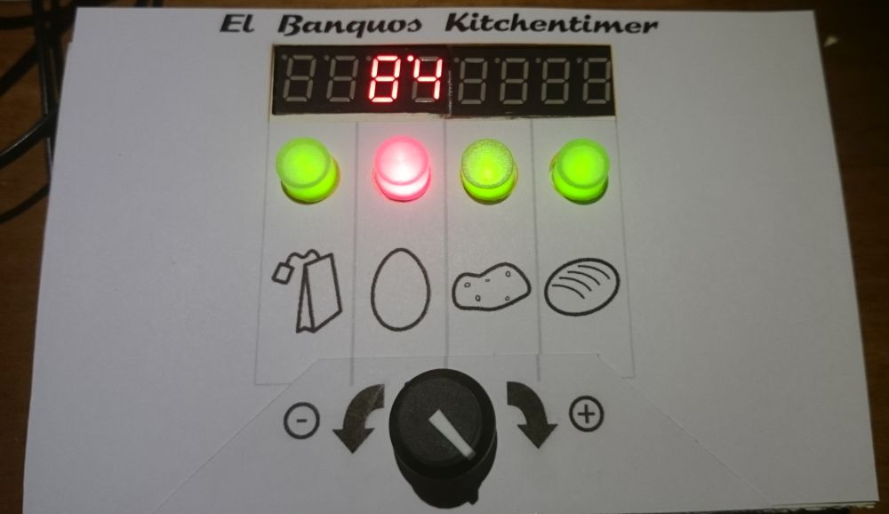
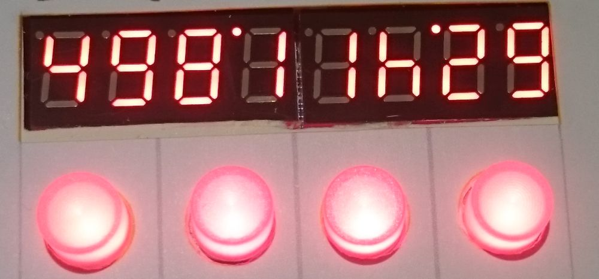
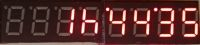

[Back to mainpage](https://mattywausb.github.io/ElBanquos_kitchentimer)
___
# Description of the device
Elbanquos Kitchentimer consist of the following elements:
* 8 digit display, using 2 digits for every timer or all digits for showing detailled time information
* one button for every timer
* one state led for every timer integrated in the button
* one general dial to adjust time values (can also be pushed)

# Quick start
To **activate** a timer, starting with a preset of **10 Minutes**:
* ***turn dial*** to adjust the time
* ***press timer button*** of an inactive timer(green or off) ->  the timer starts. Remaining time is displayed with the two digits for the timer. The timer led will be lit red continuosly.

To **activate** a timer, starting with a **timer specific preset time** :
* ***press timer button*** of your target timer (must be green or off)-> timer specific preset time will be selected, timer led will blink green
* ***turn dial*** to adapt time as needed
* ***press dial*** or the timer button ->  the timer starts. Remaining time is displayed with the two digits for the timer. The timer led will be lit red continuosly.
You can change the timer by pressing another valid timer button (Green or off) before starting.

To **check remaining time** in detail:
* ***press timer button*** of the active timer -> time will be displayed in full detail
* ***press timer button*** of the timer again -> switch back to normal display

To **adjust an active timer**:
* ***press timer button*** of the active timer -> time will be displayed in full detail
* ***turn the dial*** to change the time
* ***press dial*** or timer button ->  the timer starts with new time
 

**When reaching 0 seconds** the timer will trigger the alarm and blink in a rapid pattern.
By ***pressing the timer button*** you ackknowledge the alarm. This will also be done automatically after 45 seconds. 

The timer will continue to count the time after the alarm. The timer led will be off now. The digits of the timer will show "\_ \_" alternating to the counted time for 2 minutes. After 2 minutes, the digits will display "\_ \_" continuosly. To see the **time since the alarm**, ***press the timer button***.

To **cancel** a running the timer completely: 
* ***press and hold the timer button for 5 seconds*** -> The display will show "OF" at the timers digits for 2 seconds, and the timer is completly cancled. This will also happen automaticlly after half of the time, the timer was measuring (but at least after 3 minutes and definitly after 90 Minutes).

# Understanding the display information
## Compact display (Main display)
The compact display, shows all timer states in paralell. Every timer is represented by 2 digits of the display as follows:
* Time information
    * "zz" (two numbers, no decimal point, counting down) - remaining seconds zz  
    * "y'z" (two numbers, separated with a dot on the top) - above 60 seconds: first digit - y minutes remaining, second digit - z 10 second steps remaining
    * "'yy" (two numbers, preceded by a dot in the top) - above 10 minutes: remaining minutes
    * "xh" - (one number followed by the letter "h") - above 1 hour: remaining hours x
    * "Hx." - (letter "H" followed by number)- above 10 hours: remaining 10 hour steps
    * "vd." - (a number followed by the letter "d") - above 24 hours: remaining days 
* State information
    * empty digits - timer is not active at all
    * "\_ \_" - timer is after alarm time
    * "\_ \_" alternating with time display - timer is less then 2 minutes after alarm time
    * "°_" or "_°" - timer has alarm
	* "P" in front of the detailed time: You are currently choosing a time differential in relation to a partner timer
	* "A" in front of the detailed time: The inital start time of the timer is displayed

Example:

* Timer 1: 49 = 49 seconds 
* Timer 2: 8'1 = 8 minutes and 10-19 seconds
* Timer 3: 1h = between 1 hour and 2 hours 
* Timer 4: '29 = 29 minutes
 
## Detailed display
The detailed display is used when selecting the time or when showing detailed information for a timer. 
There are two formats:

* xx**h**'yy'zz - below 24 hours: x hours, yy minutes and zz seconds
* v**d**xx**h**'yy - above 24 hours: v days, xx hours and yy minutes.

Example:

## Meaning of the timer led
* LED **green** continuously : The timer is ***deactivated**
* LED **blinks**: Der timer is ***selected*** in the main display and might get adjusted. If two timers are blinking, the blinking green one is modified in relation to the blinking red one.
* LED **red** continuously : Timer is ***running*** 
* LED **red blinking fast with short pauses** : Timer is on ***alert***
* LED **red blinks a heart beat rhythm**: timer is ***paused***
* LED **off** continuously: The timer is over due with a deactivated alarm. Timer can to be used for a new time setting. 

# Detailied operation instructions
(to be done in english. Check [german version](https://mattywausb.github.io/ElBanquos_kitchentimer/docs/manual-de.html) for "inspiration")

Just one essential Operation is already translated here:
## Relational time setting
If you want to set a timer to end at a specific time before another timer, you can use the following assistence feature:
* Press and hold the button of the already running timer you want to use as reference
* Press the button of a not active timer, you want to use -> The active timer will blink red and the target timer will blink green. Half of the current time of the activte timer is used as a proposal for the interval. A "P" in the display indicated, you are now in the "partner mode"
* With the dial, you can adjust the time the timer will be done before the reference timer
* By pressing the dial or the green blinking timer button, you will start the second timer. The interval of the timer will be calculated in relation to the reference timer, according to the time you have defined.

Remark 1: If you dial in a time, that is bigger then the remaining time of the reference timer, the starting will trigger a short error display and the timer is not started. Instead the reference timer will be displayed again.

Remark 2: This ist only a assistence to set a timer. After starting the second timer, the relation to its reference is not kept. Changing or pausing the former reference timer will have no impact on the second timer and the difference between both timers will be changed. Nevertheless you can recover it by canceling the second timer and repeat the relational setting

# The "Melody code" of the alarm sound

The alarm sound incorporates a melody code, to allow the recognotion, wich timer is calling.
* The base melody consist of 8 bars, each playing 5 8th notes followed by a quater and an 8th pause
* every bar has a constant note, that will be shifted up depeding on the timer that has an alarm
* by counting the notes before the shifted note you get the number of the timer

Example: 
* ".'..."  = Timer 1 has an alarm
* "...'." = Timer 3 has an alarm
* ".'..'" = Timer 1 and 4 hav an alarm

# Changing precision of the dial
The timer ist changing the granularity of the dial steps inrelation to the current interval. This allows to reach  a wide amount of time with less turning.
This behaviour takes into account, that for food preparation, it is normally not necessary to be absolutly precise, especially for long intervals.  
The following table explains the granularty steps used;

    Time   Granularity
    <30 s    1 s
    <2 min   5 s
    <5 min   10 s
    <15 min  15 s
    <30 min  30 s
    <1 h     1 min
    <3 h     10 min
    <24 h    15 min
    <48 h    30 min
    >48 h     1 h
