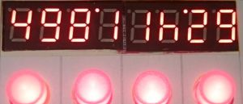

[Back to mainpage](https://mattywausb.github.io/ElBanquos_kitchentimer)
___
# Description of the device
Elbanquos Kitchentimer consist of the following elements:
* 8 digit display, using 2 digits for ervery timer or all digits for showing detailled time information
* one button for every timer
* one state led for every timer integrated in the button
* one general knob to adjust time values (can also be pushed)

# Quick start
To **activate** a timer:
* **turn knob** to adjust the time
* **press timer button** of an inactive timer(green or off) ->  the timer starts. Remaining time is displayed with the two digits for the timer. The timer led will be lit red continuosly.

To **check remaining time** in detail:
* **press timer button** of the active timer -> time will be displayed in full detail
* **press timer button** of the timer again -> switch back to normal display

**When reaching 0 seconds** the timer will trigger the alarm and blink in a rapid pattern.
By **pressing the timer button** you ackknowledge and dismiss the alarm. This will also be done automatically after 45 seconds. 

The timer will continue to count the time after the alarm. The timer led will be off now. The digits of the timer will show "\_\_" alternating to the counted time for 2 minutes. After 2 minutes, the digits will display "\_\_" continuosly. To see the time since the alarm, press the timer button.

To **cancel** a running the timer completely: 
* **press and hold the timer button** for 5 seconds -> The display will show "OF" at the timers digits for 2 seconds, and the timer is completly cancled.

# Understanding the display information
## Compact display (Main display)
The compact display, shows all timer states in paralell. Every timer is represented by 2 digits of the display as follows:
* Time information
    * "zz" (two numbers, no decimal point, counting down) - remaining seconds zz  
    * "y'z" (two numbers, separated with a dot on the top) - above 60 seconds: first digit - y minutes remaining, second digit - z 10 second steps remaining
    * "'yy" (two numbers, preceded by a dot in the top) - above 10 minutes: remaining minutes
    * "xh." - (one number followed by the letter "h") - above 1 hour: remaining hours
    * "Hx." - (letter "H" followed by number)- above 10 hours: remaining 10 hour steps
    * "vd." - (a number followed by the letter "d") - above 24 hours: remaining days 
* State information
    * empty digits - timer is not active at all
    * "\_\_" - timer is after alarm time
    * "\_\_" alternating with time display - timer is less then 2 minutes after alarm time
    * "°_" or "_°" - timer has alarm

Example:

* Timer 1: 49 = 49 seconds 
* Timer 2: 8'1 = 8 minutes and 10-19 seconds
* Timer 3: 1h = between 1 hour and 2 hours 
* Timer 4: '29 = 29 minutes
 
## Detailed display
The detailed display is used when selecting the time or when showing detailed information for a timer. 
There are two formats:

* xx**h**yy.zz - below 24 hours: x hours, yy minutes and zz seconds
* v**d**xx**h**yy. - above 24 hours: v days, xx hours and yy minutes.

Example:

## Meaning of the timer led
* LED **green** continuously : The timer is deactivated. Timer is ready to be used for a new time setting.
* LED **blinks**: Der timer is **selected** in the main display and might be modifed by next operation
* LED **red** continuously : Timer is **running** (You can only change the timer after pressing it's button first)
* LED **red blinking fast with short pauses** : Timer is on **alert**
* LED **off** continuously: The timer is over due with a deactivated alarm. Timer can to be used for a new time setting. 
* LED **red blinks heart beat rhythm**: timer is **paused**

# Detailied operation instructions
(to be done in english. Check [german version](https://mattywausb.github.io/ElBanquos_kitchentimer/docs/manual-de.html) for "inspiration")
